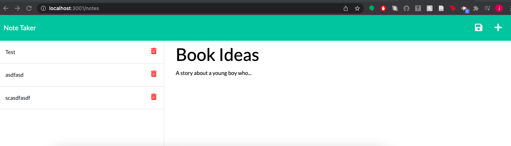

# note-taker-expressjs

## Description

The following project is a note taker app that is intented to practice building the back-end server/connecting it to the front-end. The HTML/CSS/index.js were all given prior to starting the server.js file, which employs node and express to create routes and write files. It is also active on Heroku.

Access the live page here: https://jaolsen7.github.io/note-taker-expressjs/

